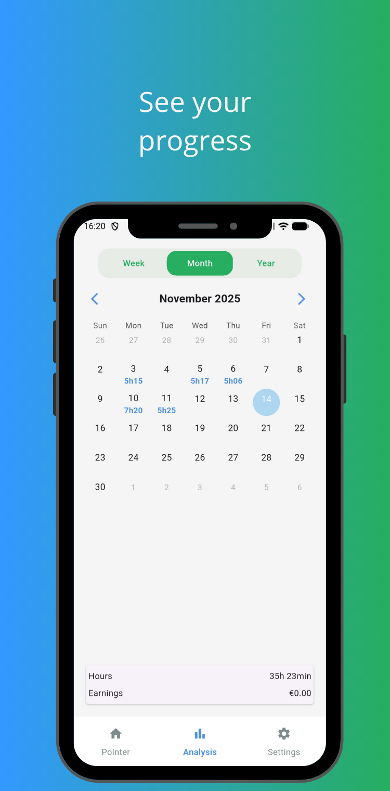
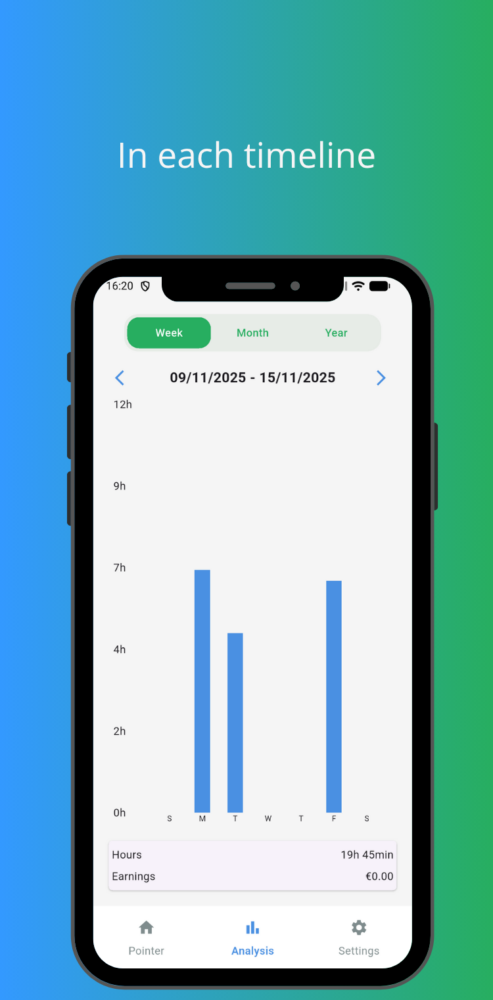
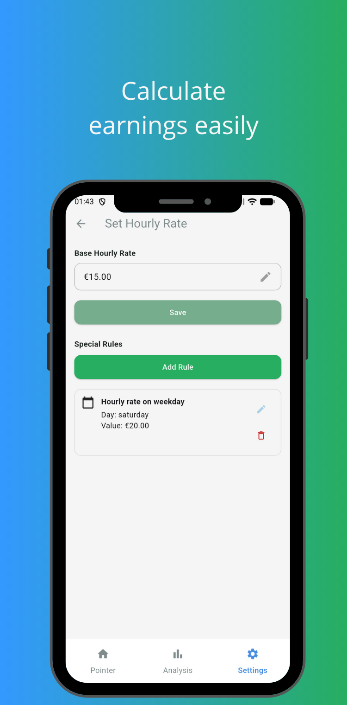
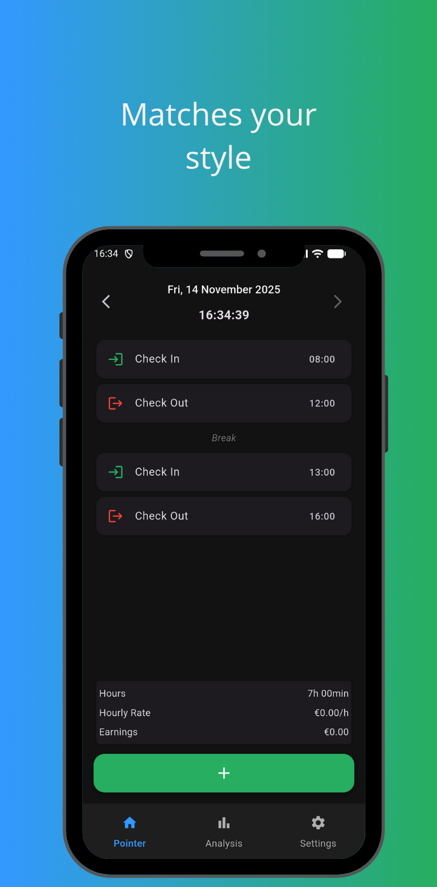

# 📘 On Time - Work Time Tracker

_On Time_ helps you track your work sessions effortlessly.  
Designed for simplicity, accuracy and full offline use, it provides clear insights into your daily, weekly and monthly work time, all stored locally on your device.

---

## Features

### 🕒 Clock In / Clock Out  
Track your work sessions with a double tap.  
Automatically organizes entries and detects day/session changes.

### 📊 Work Analysis  
- Monthly statistics  
- Weekly breakdown  
- Total worked time  
- Productivity overview  

### 💶 Hourly Rate Calculation  
Set your hourly value and instantly see earnings based on your tracked hours.

### 🎨 Light & Dark Mode  
Use the app with your preferred theme.

### 🌍 Multilingual  
The app supports multiple languages internally (English, Portuguese, French) .  
Changing the language in the app does **not** affect the device language.

---

### 🛠️ Tech Stack

- Flutter (Dart)  
- Drift (local database)  

## 📸 Presentation

  
  
  
  
  

